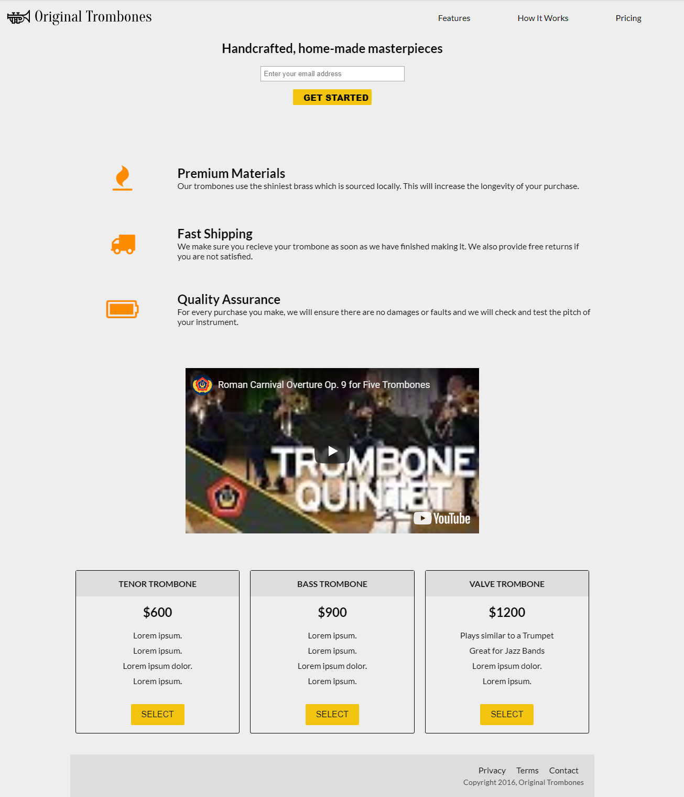

#Product landing page
Make a page for a product that you want to market for. The project will show the product and explain it.  

## Requirements:-
1. Use what you learned so far e.g: `semantics`, `transitions` and `grid`.
2. The structure should look like this :-
```
-- index.html
-- css/
---- style.css
-- assets/
---- original_trombones.png
```
Take this image as a guide for you 

## Tip:-
1. Style it with your own style and make it looks better than the image attached.
2. You can add more sections if you want e.g: `about`.
